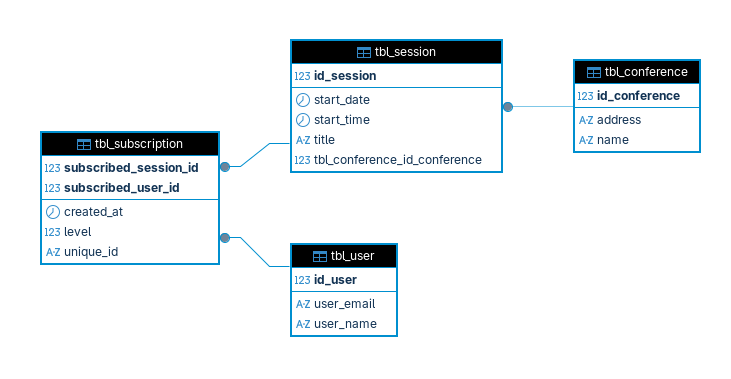

# 🎟️ Spring Events API

<p align="center">
  
</p>

<p align="center">
  
  
  
  
  
  
</p>

<p align="center">
  
  
</p>

> ⚠️ Projeto em desenvolvimento — versão inicial funcional, melhorias planejadas.

API REST para gerenciamento de eventos, desenvolvida com Spring Boot como parte da pós-graduação em Java (UNIPDS - Programa Java Elite).

---

## 📋 Sobre o projeto

O **Spring Events API** é um sistema de gerenciamento de conferências e inscrições. A API permite cadastrar conferências, criar sessões vinculadas a elas, gerenciar usuários e controlar as inscrições de usuários em sessões.

## 🗄️ Diagrama do banco de dados



- Uma **conferência** possui várias **sessões**
- Um **usuário** pode se inscrever em várias **sessões**
- A **inscrição** (`tbl_subscription`) representa o relacionamento N:N entre usuário e sessão

---

## 🚀 Tecnologias

| Tecnologia          | Versão   |
|---------------------|----------|
| Java                | 25       |
| Spring Boot         | 4.0.5    |
| Spring Web MVC      | —        |
| Spring Data JPA     | —        |
| MySQL               | 8.x      |
| Docker / Compose    | —        |
| Maven               | Wrapper  |

---

## 📁 Estrutura do projeto

```
src/main/java/br/dev/guisleri/events/
├── controller/          # Endpoints REST
├── service/             # Interfaces e implementações da camada de negócio
├── repo/                # Repositórios JPA
├── model/               # Entidades JPA
├── dto/                 # Objetos de transferência de dados
└── exception/           # Exceções customizadas
```

---

## ⚙️ Como rodar localmente

### Pré-requisitos

- Java 25+
- Docker e Docker Compose
- Maven (ou use o `mvnw` incluso)

### 1. Clone o repositório

```bash
git clone https://github.com/marcosguisleri/spring-events-api.git
cd spring-events-api
```

### 2. Configure as variáveis de ambiente

Copie o arquivo de exemplo e preencha com suas credenciais:

```bash
cp src/main/resources/application-local.properties.example src/main/resources/application-local.properties
```

Edite `application-local.properties`:

```properties
spring.datasource.username=seu_usuario
spring.datasource.password=sua_senha
spring.datasource.url=jdbc:mysql://localhost:3306/db_events
```

### 3. Suba o banco de dados com Docker

```bash
docker compose up -d
```

### 4. Execute a aplicação

```bash
./mvnw spring-boot:run
```

A API estará disponível em: `http://localhost:8080`

---

## 📡 Endpoints

### Conferências

| Método | Endpoint              | Descrição                     |
|--------|-----------------------|-------------------------------|
| GET    | `/conferences`        | Lista todas as conferências   |
| GET    | `/conferences/{id}`   | Busca conferência por ID      |
| POST   | `/conferences`        | Cria uma nova conferência     |
| PUT    | `/conferences/{id}`   | Atualiza uma conferência      |
| DELETE | `/conferences/{id}`   | Remove uma conferência        |

### Sessões

| Método | Endpoint           | Descrição                  |
|--------|--------------------|----------------------------|
| GET    | `/sessions`        | Lista todas as sessões     |
| GET    | `/sessions/{id}`   | Busca sessão por ID        |
| POST   | `/sessions`        | Cria uma nova sessão       |
| PUT    | `/sessions/{id}`   | Atualiza uma sessão        |
| DELETE | `/sessions/{id}`   | Remove uma sessão          |

### Usuários

| Método | Endpoint        | Descrição                |
|--------|-----------------|--------------------------|
| GET    | `/users`        | Lista todos os usuários  |
| GET    | `/users/{id}`   | Busca usuário por ID     |
| POST   | `/users`        | Cria um novo usuário     |
| PUT    | `/users/{id}`   | Atualiza um usuário      |
| DELETE | `/users/{id}`   | Remove um usuário        |

### Inscrições

| Método | Endpoint                           | Descrição                              |
|--------|------------------------------------|----------------------------------------|
| GET    | `/subscriptions`                   | Lista todas as inscrições              |
| GET    | `/subscriptions/user/{userId}`     | Busca inscrições por usuário           |
| GET    | `/subscriptions/sessions/{id}`     | Busca inscrições por sessão            |
| POST   | `/subscriptions`                   | Cria uma nova inscrição                |

---

## 📌 Status do desenvolvimento

- [x] Modelagem das entidades com JPA
- [x] Repositórios com Spring Data
- [x] Camada de serviço com interfaces
- [x] Controllers REST
- [x] Tratamento de exceções global (`ControllerExceptionHandler`)
- [ ] Validações com Bean Validation (`@Valid`)
- [ ] DTOs de request/response para desacoplar entidades da API
- [ ] Documentação com Swagger/OpenAPI
- [ ] Testes unitários e de integração
- [ ] Docker Compose configurado

---

## 👨‍💻 Autor

**Marcos Guisleri**
- GitHub: [@marcosguisleri](https://github.com/marcosguisleri)
- LinkedIn: [linkedin.com/in/marcosguisleri](https://linkedin.com/in/marcosguisleri)
